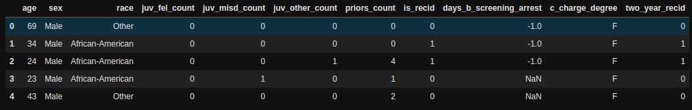
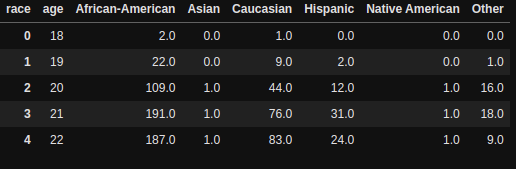

# Pandas

## Pillar un valor filtrando DF con condición múltiple:
```python
valor = df[(df["columna_x"] == x) & (df["columna_x"] == y)]["columna"].iloc[0]
```

---

## Si vas a crear un nuevo DF, hacerlo con .copy() ⚠️⚠️⚠️
Para evitar el error de "A value is trying to be set on a copy of a slice from a DataFrame."

```python
# df_b es un nuevo DF, sin el .copy() se guarda una vista y sale un warning si quieres meterle movidas
df_b = df_mysql[df_mysql["fecha"] > datetime(2020,6,9,0,0)].copy()
df_b["deficit"] = df_b["motos_disponibles"] - df_b["iniciadosMySQL"]
```
--- 

## Take DF columns/rows by column/row index
`df.iloc[row,col]`
```python
df_smaller = df.iloc[1:,:] # from row 1 to end (skiping row 0),and all columns
```
---

## Devolver fila completa con valor máximo
```python
df.loc[df['Value'].idxmax()]
```
## Hacer un count groupby y devolviendolo como DF decente

```python
df.groupby(['col1', 'col2']).size().reset_index(name='counts')
```

---

## Aplicar función custom para DF usando Lambda

Añade un nuevo campo al dataframe dependiendo de una condición calculada por función.
Con list comprehension no se pueden utilizar funciones custom.

Se puede acceder al campo de la fila ya sea con `row["campo"]` o `row.campo`
```python
df["mov"] = df.apply(lambda row: False if viaje_terminado_cerca(row["pos_init"], row.pos_fin) else True, axis=1)

```
Con esto podrías filtrar las nuevas filas que no hayan terminado cerca (movimiento = true)
```python
df = df[df["mov"] == True]
```

### Aplicar función a un índice 
Como el df.apply pero para aplicarselo al índice (si por ejemplo tienes una fecha como índice).

```python
df_serie["week_day"] = df_serie.index.map(lambda fecha: fecha.weekday())
```

---

## Aplicar "filtro" a determiandos valores de DF

Por ejemplo si quieres reemplazar todos los 0 de una columna por un número

```python
mask = df["columna"] == 0
df.loc[mask, "columna"] = new_value
```

---

## Rows to columns using unstack
You have this DF



```python
# Group by the columns
df = df.groupby(["race", "age"]).size()
df
```
```
race              age
African-American  18       2
                  19      22
                  20     109
                  21     191
                  22     187
                        ... 
Other             63       1
                  64       1
                  66       1
                  69       2
                  70       1
Length: 263, dtype: int64
```

Then do a `unstack`
```python
df = df.unstack("race").reset_index().fillna(0)
df.head()
```

