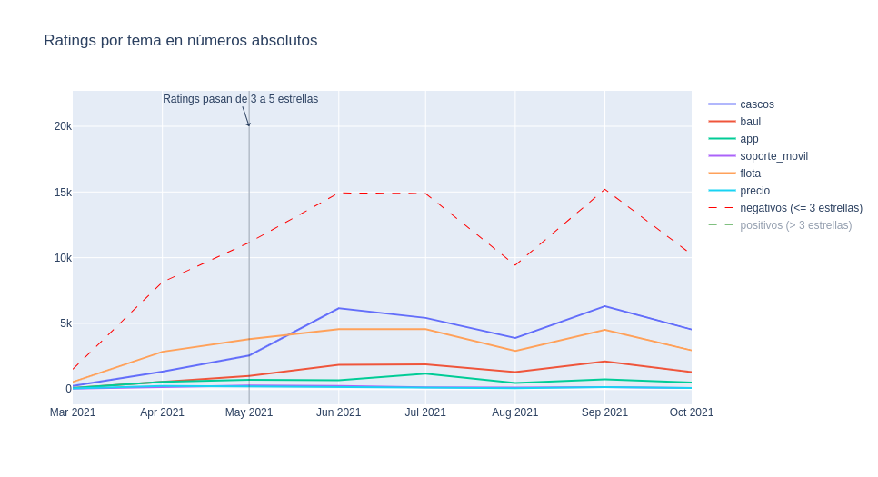

# Matplotlib
## Subfigures Matplotlib

```python
fig, axs = plt.subplots(n_rows,n_cols, sharex=True, sharey=True, figsize=(15,15))

for idx, face in enumerate(eigenfaces[:n_rows*n_cols]):
    axs[idx//n_rows, idx%n_cols].plot(your_data)

```

# Plotly

## Crear figura con multiples líneas

```python
import plotly.express as px
import pandas as pd

df = pd.read_csv("data/serie_atocha_crudo.csv")
# columnas = fecha, motos_disponibles, iniciados, finalizados


fig = px.line(df, x="fecha", y=["motos_disponibles", "iniciados"],  width=2200, height=1000, title="layout.hovermode='x'")
fig.update_layout(hovermode="x") # para que al pasar el cursor te muestre ambos valores
fig.show()

```

## Figure with multiple lines from different dfs and vetical line with annotation

```python
import plotly.graph_objects as go
import plotly.express as px

fig1 = px.line(title="Ratings por tema en números absolutos")


fig1.add_trace(
          go.Scatter(
            x=quejas['fecha'],
            y=quejas["counts_"],
            name="name",            
            #line = dict(color=colors[i]),
            mode="lines"
          )
)


fig1.add_trace(
    go.Scatter(
        x=df_count_posneg['date_trunc'],
        y=df_count_posneg["count_negativos"],
        name="negativos (<= 3 estrellas)",            
        line = dict(color="red", width=1,dash='dash'),
        mode="lines"
        #dash="dash"
    )
)

fig1.add_trace(
    go.Scatter(
        x=df_count_posneg['date_trunc'],
        y=df_count_posneg["count_positivos"],
        name="positivos (> 3 estrellas)",            
        line = dict(color="green", width=1,dash='dash'),
        mode="lines"
        #dash="dash"
    )
)

fig1.add_annotation(x="2021-05-01", y=20000,
    text="Ratings pasan de 3 a 5 estrellas",
    showarrow=True,
    arrowhead=1
)
    
fig1.add_vline(x="2021-05-01", line_width=0.5)#, x1=2)

fig1.show()
```



### Histogram when Y axis is already computed
Use ```px.bar()```

```px.histogram()``` won´t work because it will try to count the Y axis again lmao.

```
          fecha                   finalizados
0	2021-10-06 00:00:00	  2
1	2021-10-07 00:00:00	  39
2	2021-10-08 00:00:00	  63
3	2021-10-09 00:00:00	  44
4	2021-10-10 00:00:00	  60
```

```python
fig = px.bar(finalizados_dias_df, x="fecha", y="finalizados")
fig.show()
```
